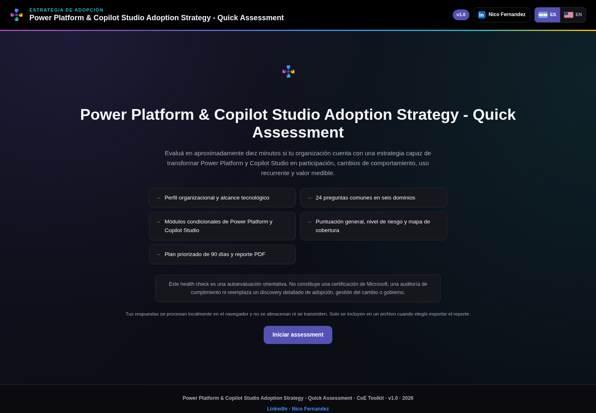
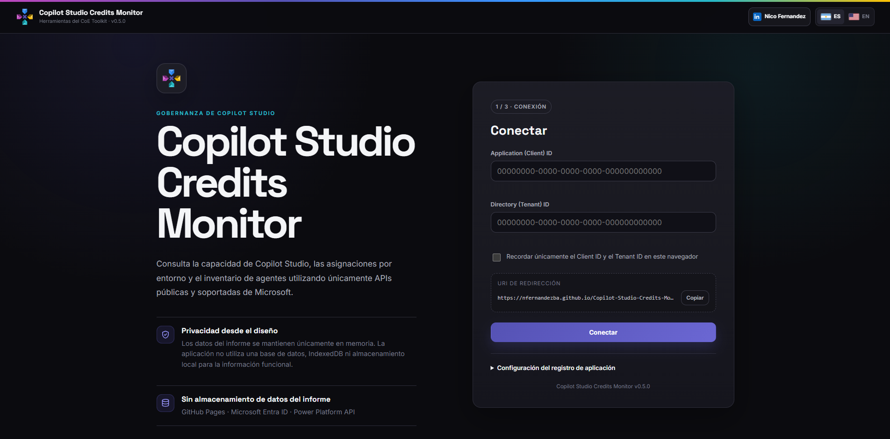
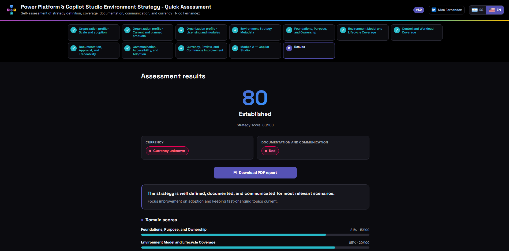
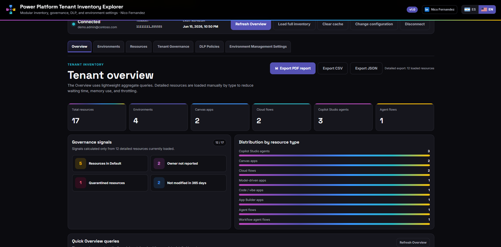
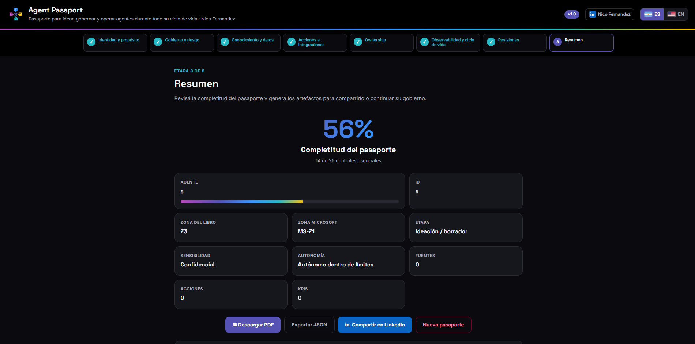

# Power Platform & Copilot Studio Adoption Strategy - Quick Assessment


A bilingual, browser-based open-source assessment that helps organizations evaluate the maturity of their Power Platform and Copilot Studio adoption strategy. It produces weighted results, risk findings, priority recommendations, and a downloadable executive PDF without transmitting assessment responses.

**Public assessment version: 1.0**

[Español](#español) · [English](#english)

---



## About this project

**Power Platform & Copilot Studio Adoption Strategy - Quick Assessment** is a community-driven, bilingual self-assessment designed to help organizations evaluate whether their adoption strategy can turn available technology into sustained participation, recurring use, scalable solutions and agents, and measurable business value.

The assessment goes beyond checking whether training, communications, communities, or champions exist. It examines whether the organization has a coherent adoption system that connects strategy, audiences, capability building, governance, use-case activation, behavioural change, value realization, and continuous improvement.

The tool is intentionally lightweight: it runs directly in a web browser, does not require installation or authentication, and can be published as a static website. It is suitable for an initial adoption health check, a Center of Excellence workshop, a change-management discussion, a roadmap exercise, or a structured conversation between business leaders, adoption teams, platform owners, makers, agent owners, and governance stakeholders.

### What the assessment provides

After completing the questionnaire, the user receives:

- an overall adoption maturity score from 0 to 100;
- an adoption maturity level;
- an independent red, amber, or green risk status;
- a completion indicator;
- weighted results across six assessment domains;
- separate results for the Power Platform and Copilot Studio modules when applicable;
- a question-level coverage map;
- key strengths and priority gaps;
- critical risk findings;
- up to five prioritized recommendations;
- an indicative 90-day action plan;
- contextual findings based on adoption stage, management model, technologies, and audiences;
- a downloadable executive PDF report.

### Downloadable PDF report

The final results page includes an option to generate and download a multi-page PDF report. The report is created locally in the browser from the responses provided during the assessment.

The PDF is intended to support:

- Center of Excellence and adoption workshops;
- executive and steering committee discussions;
- change-management and enablement planning;
- adoption roadmap creation;
- prioritization of improvement initiatives;
- documentation of an initial baseline;
- comparison with future assessment results.

Depending on the answers provided, the report contains the overall score, maturity level, risk status, completion rate, organizational context, domain results, technology-module results, strengths, risks, priority actions, a 90-day plan, the question-level coverage map, open responses, scale definitions, related tools, books, disclaimers, and author links.

### Privacy by design

The assessment is designed to process responses locally in the browser.

It does **not** require:

- a user account;
- a Microsoft tenant connection;
- an email address;
- a backend service;
- a database;
- analytics;
- submission of responses to the author.

Assessment answers remain in memory during the current browser session. The language preference may be stored locally in the browser. Answers are not automatically uploaded or transmitted.

External requests used to load fonts, the PDF library, book covers, or linked resources do not include assessment responses.

> This project is a self-assessment and guidance tool. It does not replace a detailed adoption discovery, organizational change assessment, technical review, security assessment, compliance audit, licensing review, or Microsoft certification.

---

# Español

## Descripción

**Power Platform & Copilot Studio Adoption Strategy - Quick Assessment** es una herramienta web bilingüe de autoevaluación creada para la comunidad de Power Platform.

Permite analizar si una organización dispone de una estrategia de adopción capaz de transformar la disponibilidad de Power Platform y Copilot Studio en participación sostenida, desarrollo de capacidades, cambios de comportamiento, uso recurrente, escalado de casos de uso y resultados medibles.

El assessment está orientado a:

- responsables de Power Platform y Copilot Studio;
- líderes y miembros de Centros de Excelencia;
- responsables de adopción, comunicación y gestión del cambio;
- community managers y responsables de redes de champions;
- responsables de negocio y owners de casos de uso;
- makers, desarrolladores profesionales y arquitectos;
- propietarios y operadores de agentes;
- equipos de gobierno, seguridad, riesgo y compliance;
- responsables de medición y realización de valor.

La herramienta no inspecciona automáticamente el tenant ni mide directamente el uso real de las soluciones. Evalúa las capacidades declaradas por la organización y funciona como punto de entrada para un discovery, una revisión de adopción o la definición de un roadmap más detallado.

## Cómo funciona el assessment

El usuario recorre un flujo guiado compuesto por cuatro tipos de información:

1. **Perfil organizacional:** captura la etapa de adopción, el modelo de gestión, las tecnologías incluidas y las audiencias prioritarias.
2. **Preguntas principales:** evalúa la madurez de la estrategia en seis dominios ponderados.
3. **Módulos condicionales:** profundiza en Power Platform y Copilot Studio cuando esas tecnologías forman parte del alcance.
4. **Contexto y prioridades:** recoge la principal barrera, la audiencia con mayor oportunidad y el resultado esperado para los próximos 90 días.

Las respuestas del perfil no se utilizan para inflar o reducir artificialmente el score. Sirven para contextualizar el resultado y activar los módulos aplicables.

Las preguntas marcadas como **No aplicable** se excluyen del denominador. Los módulos que no se activan no se muestran y no afectan el cálculo.

## Objetivo del assessment

El objetivo principal es ayudar a una organización a responder una pregunta concreta:

> ¿Contamos con una estrategia de adopción suficientemente estructurada para convertir Power Platform y Copilot Studio en comportamientos sostenibles y valor medible?

Para responderla, la herramienta separa cuatro aspectos que no deberían confundirse:

- **Capacidades de adopción:** si existen estrategia, patrocinio, enablement, comunidad, soporte y procesos.
- **Comportamientos:** si las personas progresan, participan y utilizan las soluciones o agentes de forma recurrente.
- **Valor:** si los casos de uso producen resultados medibles.
- **Sostenibilidad:** si el modelo cuenta con ownership, recursos, medición y mejora continua.

Esta separación evita que una organización obtenga una valoración artificialmente alta únicamente por disponer de cursos, comunicaciones, licencias, aplicaciones, agentes o usuarios registrados.

## Qué recibe el usuario al finalizar

Al completar el assessment, la página de resultados presenta:

- score general de 0 a 100;
- nivel de madurez;
- estado de riesgo rojo, ámbar o verde;
- porcentaje de completitud;
- resultado porcentual de cada dominio;
- resultado específico de Power Platform, cuando corresponde;
- resultado específico de Copilot Studio, cuando corresponde;
- mapa de cobertura por pregunta;
- principales fortalezas;
- brechas prioritarias;
- riesgos críticos;
- hasta cinco acciones recomendadas;
- plan orientativo de 90 días;
- contexto aportado mediante las preguntas abiertas.

### Reporte PDF descargable

La página final permite descargar un reporte ejecutivo en PDF generado directamente en el navegador.

El reporte puede utilizarse como:

- evidencia de un diagnóstico inicial;
- material de trabajo para un workshop;
- insumo para una estrategia de adopción;
- resumen para un comité de gobierno o transformación;
- base para un backlog de mejoras;
- referencia para comparar futuras evaluaciones.

El PDF incluye, según corresponda:

- nombre y versión del assessment;
- fecha de generación;
- score general y nivel de madurez;
- estado de riesgo;
- porcentaje de completitud;
- perfil organizacional;
- resultados por dominio;
- resultados de los módulos tecnológicos;
- fortalezas y brechas;
- riesgos críticos;
- acciones prioritarias;
- plan de 90 días;
- mapa de cobertura;
- respuestas abiertas;
- definiciones de la escala;
- disclaimer;
- enlace al perfil de LinkedIn del autor;
- herramientas y libros relacionados.

El archivo PDF se crea localmente a partir de las respuestas introducidas. La descarga no implica el envío de datos a un servidor.

## Privacidad y tratamiento de datos

La privacidad es un principio de diseño del assessment.

La herramienta:

- procesa las respuestas localmente en el navegador;
- no requiere login;
- no solicita correo electrónico;
- no se conecta al tenant de Microsoft;
- no utiliza una base de datos;
- no guarda las respuestas en el repositorio;
- no incorpora analítica de comportamiento;
- no envía las respuestas al autor ni a terceros.

Las respuestas existen únicamente durante la sesión del navegador. Al cerrar o recargar la página pueden perderse. La preferencia de idioma puede almacenarse localmente.

La aplicación puede realizar solicitudes externas para cargar fuentes, la librería de generación de PDF, portadas o enlaces de recursos. Esas solicitudes no contienen las respuestas del assessment.

Para una implementación completamente aislada u offline, las dependencias externas pueden alojarse localmente.

## Objetivos

El assessment ayuda a determinar:

1. Si existe una estrategia formal de adopción.
2. Si cuenta con patrocinio ejecutivo activo.
3. Si las audiencias están identificadas y segmentadas.
4. Si existen recorridos de adopción diferenciados.
5. Si la capacitación, la comunidad y el soporte permiten desarrollar capacidades.
6. Si el acceso y el gobierno generan claridad y confianza.
7. Si existe un proceso para identificar, priorizar y escalar casos de uso.
8. Si la organización mide comportamientos y resultados.
9. Si el modelo dispone de recursos, ownership y mejora continua.
10. Si Power Platform y Copilot Studio cuentan con recorridos específicos de adopción.
11. Qué áreas presentan mayor riesgo o requieren intervención.
12. Qué acciones deberían priorizarse durante los próximos 90 días.

## Qué evalúa

- Estrategia formal de adopción.
- Alineamiento con objetivos de negocio y transformación.
- Patrocinio ejecutivo.
- Recursos, financiación y revisión de la estrategia.
- Segmentación de audiencias.
- Necesidades, motivaciones y barreras.
- Recorridos desde el descubrimiento hasta el uso recurrente.
- Propuestas de valor por audiencia.
- Itinerarios de aprendizaje.
- Aprendizaje aplicado.
- Comunidades y redes de champions.
- Soporte, mentoring y office hours.
- Onboarding, licencias y acceso.
- Comprensión de políticas y responsabilidades.
- Excepciones y escalado de decisiones.
- Proporcionalidad de los controles.
- Ideación, intake y priorización.
- Escalado de pilotos y prototipos.
- Gestión del portfolio.
- Métricas de actividad, comportamiento y resultado.
- Realización de valor.
- Sostenibilidad y continuous enhancement.
- Progresión de makers.
- Transición de soluciones a producción.
- Confianza, calidad y mejora de agentes.

## Qué no evalúa

- Inspección automática del tenant.
- Medición directa del uso real mediante APIs.
- Validación técnica de políticas DLP.
- Revisión exhaustiva de configuraciones de seguridad.
- Auditoría de cumplimiento.
- Revisión de licenciamiento.
- Evaluación detallada de cada aplicación, flujo, agente o sitio.
- Calidad técnica del código o de las soluciones.
- Benchmarking frente a otras organizaciones.
- Certificación de Microsoft.
- Sustitución de un discovery o assessment profesional detallado.

## Estructura del assessment

| Componente | Cantidad | Finalidad |
|---|---:|---|
| Perfil organizacional | 4 preguntas | Contextualizar etapa, modelo, tecnologías y audiencias |
| Preguntas principales | 24 | Evaluar la madurez de la estrategia en seis dominios |
| Módulo Power Platform | Hasta 3 | Profundizar makers, producción, uso y valor |
| Módulo Copilot Studio | Hasta 3 | Profundizar creación, confianza, operación y mejora de agentes |
| Preguntas abiertas | 3 | Capturar barreras, oportunidades y objetivo a 90 días |
| Resultado | N/A | Mostrar score, riesgo, cobertura, fortalezas y acciones |

## Dominios y ponderaciones

| Dominio | Peso |
|---|---:|
| Estrategia, objetivos y patrocinio | 20% |
| Audiencias y recorridos de adopción | 15% |
| Capacitación, comunidad y acompañamiento | 15% |
| Acceso, gobierno y confianza | 15% |
| Activación y escalado de casos de uso | 15% |
| Medición, valor y sostenibilidad | 20% |
| **Total** | **100%** |

## Módulos condicionales

### Power Platform

Se activa cuando la organización selecciona Power Apps, Power Automate, Power BI o Power Pages.

Evalúa:

- perfiles y progresión de makers;
- transición desde prototipos hasta soluciones productivas;
- ownership, soporte, seguridad y ciclo de vida;
- adopción por usuarios finales;
- uso recurrente;
- medición de valor;
- escalado, mejora o retirada de soluciones.

### Copilot Studio

Se activa cuando la organización selecciona Copilot Studio.

Evalúa:

- orientación para creadores y propietarios;
- propósito y audiencias;
- knowledge sources y acciones;
- pruebas, riesgos y responsabilidades operativas;
- comprensión de capacidades y limitaciones;
- confianza apropiada del usuario;
- verificación y escalado humano;
- calidad, resolución y feedback;
- mejora continua del agente.

Los módulos que no se activan no se muestran y no afectan el cálculo del score principal.

## Escala de respuesta

| Valor | Respuesta | Interpretación |
|---:|---|---|
| 0 | Inexistente | La capacidad no existe o no fue considerada. |
| 1 | Inicial | Existen actividades aisladas, informales o dependientes de personas concretas. |
| 2 | Definido | La capacidad fue diseñada o documentada, pero se aplica parcialmente. |
| 3 | Gestionado | La capacidad se aplica de forma consistente y se revisa mediante evidencias. |
| 4 | Optimizado | La capacidad se mide, mejora continuamente y se conecta con resultados de negocio. |
| N/A | No aplicable | La pregunta no corresponde al contexto de la organización y se excluye del cálculo. |

## Modelo de puntuación

El porcentaje de cada dominio se calcula sobre las preguntas respondidas y aplicables:

```text
Porcentaje del dominio =
    Puntos obtenidos
    ---------------- × 100
    Máximo posible
```

La contribución de cada dominio se obtiene aplicando su ponderación:

```text
Contribución ponderada =
    Porcentaje del dominio × Peso del dominio
```

El score general es la suma de las contribuciones ponderadas y se redondea al entero más cercano.

| Score | Nivel | Interpretación |
|---:|---|---|
| 0–39 | Inicial | La adopción depende principalmente de iniciativas aisladas. |
| 40–59 | Emergente | Existen capacidades relevantes, pero están fragmentadas o se aplican de manera inconsistente. |
| 60–74 | Definido | La estrategia y las capacidades principales están establecidas. |
| 75–89 | Gestionado | La adopción se ejecuta de forma consistente y se gestiona mediante evidencias. |
| 90–100 | Optimizado | La adopción está integrada en el negocio y evoluciona mediante medición y mejora continua. |

## Modelo de riesgo

El estado de riesgo se calcula de forma independiente del score general.

### Rojo

Se genera cuando:

- una pregunta crítica obtiene 0; o
- dos o más preguntas críticas obtienen 1.

### Ámbar

Se genera cuando no existe una condición roja y:

- una pregunta crítica obtiene 1; o
- dos o más preguntas críticas obtienen 2.

### Verde

Se genera cuando no existen condiciones rojas o ámbar.

Este enfoque impide que una puntuación general alta compense automáticamente una ausencia crítica de patrocinio, gobierno, medición, ownership o supervisión.

## Modo de prueba

La aplicación incorpora un modo de prueba para validar la experiencia completa sin tener que responder manualmente todas las preguntas.

### Abrir el modo de prueba

```text
index.html?test=1
```

También se admite:

```text
index.html?mode=test
```

El modo de prueba muestra un panel adicional desde el que se puede:

- cargar un assessment de ejemplo completamente respondido;
- abrir directamente la página de resultados;
- ejecutar los tests internos de la aplicación;
- descargar un reporte PDF de ejemplo en el idioma activo.

### Abrir directamente los resultados de ejemplo

```text
index.html?test=1&sample=1
```

El dataset de ejemplo activa los módulos de Power Platform y Copilot Studio y genera un resultado determinista:

- puntuación general: **76/100**;
- nivel: **Gestionado**;
- riesgo: **Verde**;
- completitud: **100 %**.

Los datos son ficticios y se utilizan exclusivamente para demostración y pruebas.

### Descargar automáticamente el reporte de ejemplo

```text
index.html?test=1&sample=1&autopdf=1
```

La descarga automática puede estar sujeta a la política de descargas del navegador. El panel de prueba mantiene disponible un botón manual alternativo.

### API de prueba

Cuando el modo de prueba está activo, la aplicación expone temporalmente:

```javascript
window.__coeTestApi
```

Métodos disponibles:

```javascript
window.__coeTestApi.loadSample();
window.__coeTestApi.downloadSamplePdf();
window.__coeTestApi.runSelfTests();
window.__coeTestApi.getState();
```

Esta API está destinada a pruebas funcionales y automatizadas. No modifica la versión pública de la herramienta.

## Dependencias externas

La aplicación utiliza:

- [Google Fonts](https://fonts.google.com/) para `Space Grotesk` e `Inter`.
- [jsPDF 2.5.1](https://github.com/parallax/jsPDF) para generar el reporte PDF.
- Enlaces e imágenes de Amazon para acceder a las ediciones de los libros.

Para una distribución completamente offline, descargá y serví localmente Google Fonts, jsPDF y los recursos gráficos, y actualizá las referencias del archivo HTML.

## Privacidad

Las respuestas:

- se procesan localmente en el navegador;
- no se almacenan en una base de datos;
- no se envían a un servidor;
- no requieren identificación;
- no utilizan analítica;
- no requieren correo electrónico.

La preferencia de idioma puede almacenarse mediante `localStorage`.

El usuario puede elegir voluntariamente descargar, guardar o compartir el reporte PDF.

Las solicitudes realizadas para cargar fuentes, librerías o imágenes externas no contienen las respuestas del assessment.

## Herramientas adicionales del CoE Toolkit

Las siguientes herramientas complementan el assessment de adopción y cubren distintos aspectos del gobierno, inventario, capacidad y ciclo de vida de Power Platform y Copilot Studio.

### Copilot Studio Credits Monitor

Aplicación bilingüe para consultar la capacidad de Copilot Studio, sus asignaciones por entorno y el inventario de agentes utilizando APIs públicas y soportadas de Microsoft. La información funcional se mantiene únicamente en memoria durante la sesión.

[](https://nfernandezba.github.io/Copilot-Studio-Credits-Monitor/)

[Acceder a Copilot Studio Credits Monitor](https://nfernandezba.github.io/Copilot-Studio-Credits-Monitor/)

### Power Platform & Copilot Studio Environment Strategy - Quick Assessment

Assessment bilingüe para evaluar la definición, cobertura, documentación, aprobación, comunicación y vigencia de la estrategia de entornos de Power Platform y Copilot Studio.

[](https://nfernandezba.github.io/Power-Platform-Copilot-Studio-Environment-Assessment/)

[Acceder al Environment Strategy Quick Assessment](https://nfernandezba.github.io/Power-Platform-Copilot-Studio-Environment-Assessment/)

### Power Platform Tenant Inventory Explorer

Explorador modular para obtener una visión del tenant, los entornos, los recursos, las señales de gobierno, las políticas DLP y las configuraciones de administración. Permite exportar los resultados en PDF, CSV y JSON.

[](https://nfernandezba.github.io/power-platform-tenant-inventory-explorer/)

[Acceder a Power Platform Tenant Inventory Explorer](https://nfernandezba.github.io/power-platform-tenant-inventory-explorer/)

### Agent Passport

Herramienta bilingüe para idear, gobernar y operar agentes durante todo su ciclo de vida. Organiza la información del agente en identidad y propósito, gobierno y riesgo, conocimiento y datos, acciones e integraciones, ownership, observabilidad, ciclo de vida y revisiones, y permite generar artefactos en PDF y JSON.


## Libros relacionados

### Español

- [Definiendo la estructura marco para el Centro de Excelencia de Power Platform](https://www.amazon.com/-/es/Definiendo-estructura-Centro-Excelencia-Platform/dp/B0FSDWQMHW/ref=tmm_pap_swatch_0)
- [Copilot Studio y el futuro del Centro de Excelencia de Power Platform](https://www.amazon.com/-/es/Nicol%C3%A1s-Andr%C3%A9s-Fern%C3%A1ndez/dp/B0GZGL3T1K/ref=tmm_pap_swatch_0)

### English

- [Defining the Framework Structure for the Power Platform Center of Excellence](https://www.amazon.com/-/es/Defining-Framework-Structure-Platform-Excellence/dp/B0GDDRCD2C/ref=tmm_pap_swatch_0)
- [Copilot Studio and the Future of the Power Platform Center of Excellence](https://www.amazon.com/-/es/Nicol%C3%A1s-Andr%C3%A9s-Fern%C3%A1ndez/dp/B0H2VTJZGR/ref=tmm_pap_swatch_0)

## Autor

**Nico Fernandez**

[](https://www.linkedin.com/in/nfernandezba)

## Licencia

El código fuente, la lógica del assessment y la documentación de este repositorio se distribuyen bajo la **MIT License**. Consultá el archivo [LICENSE](LICENSE).

La licencia MIT permite utilizar, copiar, modificar, combinar, publicar y distribuir el proyecto, siempre que se conserve el aviso de copyright y la licencia.

### Activos excluidos de la licencia MIT

Salvo indicación expresa, los siguientes activos no se distribuyen bajo la licencia MIT:

- nombre, logotipo e identidad visual personal de Nico Fernandez;
- portadas de libros;
- contenido de los libros;
- marcas, logotipos y activos de terceros;
- marcas registradas de Microsoft.

Su inclusión en la herramienta o en el repositorio no concede derechos independientes de reutilización, modificación, redistribución o explotación comercial.

Los forks y adaptaciones deberían reemplazar o eliminar estos activos cuando no cuenten con autorización para utilizarlos.

## Marcas registradas

Microsoft, Power Platform, Power Apps, Power Automate, Power BI, Power Pages, Copilot Studio, Dataverse, Microsoft 365 y Dynamics 365 son marcas del grupo de empresas Microsoft.

Este proyecto es un recurso independiente creado para la comunidad. No está afiliado, patrocinado, certificado ni respaldado por Microsoft.

## Disclaimer

Este assessment es una autoevaluación orientativa destinada a identificar capacidades y áreas que podrían requerir desarrollo o revisión.

No constituye:

- una certificación de Microsoft;
- una auditoría de cumplimiento;
- una evaluación de seguridad;
- asesoramiento legal;
- asesoramiento de licenciamiento;
- una garantía de adopción;
- una valoración financiera;
- un sustituto de un discovery, assessment o revisión profesional detallada.

El uso de la herramienta y la interpretación de sus resultados son responsabilidad del usuario.

---

# English

## Overview

**Power Platform & Copilot Studio Adoption Strategy - Quick Assessment** is a bilingual, browser-based open-source self-assessment created for the Power Platform community.

It helps organizations determine whether their adoption strategy can turn Power Platform and Copilot Studio into sustained participation, capability development, behavioural change, recurring use, scalable use cases, and measurable business outcomes.

The assessment is intended for:

- Power Platform and Copilot Studio owners;
- Center of Excellence leaders and members;
- adoption, communications, and organizational change leaders;
- community managers and champion-network owners;
- business leaders and use-case owners;
- makers, professional developers, and architects;
- agent owners and operators;
- governance, security, risk, and compliance teams;
- value realization and measurement owners.

The tool does not automatically inspect the tenant or directly measure solution usage. It evaluates the organization’s declared capabilities and acts as an entry point for deeper adoption discovery, change assessment, or roadmap definition.

## How the assessment works

The user follows a guided flow containing four types of information:

1. **Organizational profile:** captures adoption stage, management model, technologies in scope, and priority audiences.
2. **Core questions:** assesses adoption maturity across six weighted domains.
3. **Conditional modules:** extends the assessment for Power Platform and Copilot Studio when those technologies are in scope.
4. **Context and priorities:** captures the main barrier, the audience with the greatest opportunity, and the expected 90-day outcome.

Profile answers do not artificially increase or reduce the primary score. They contextualize findings and activate applicable modules.

Answers marked **Not applicable** are excluded from the denominator. Modules that are not activated are not displayed and do not affect scoring.

## Assessment objective

The primary objective is to help an organization answer one practical question:

> Do we have an adoption strategy that is sufficiently structured to turn Power Platform and Copilot Studio into sustainable behaviours and measurable value?

The tool separates four elements that should not be treated as equivalent:

- **Adoption capabilities:** whether strategy, sponsorship, enablement, community, support, and processes exist.
- **Behaviours:** whether people progress, participate, and use solutions or agents repeatedly.
- **Value:** whether priority use cases deliver measurable outcomes.
- **Sustainability:** whether the model has ownership, resources, measurement, and continuous improvement.

This prevents an organization from receiving an artificially high result solely because courses, communications, licenses, applications, agents, or registered users exist.

## What the user receives

The results page provides:

- an overall score from 0 to 100;
- an adoption maturity level;
- a red, amber, or green risk status;
- a completion percentage;
- a percentage result for each domain;
- a separate Power Platform module result when applicable;
- a separate Copilot Studio module result when applicable;
- a question-level coverage map;
- key strengths;
- priority gaps;
- critical risks;
- up to five recommended actions;
- an indicative 90-day action plan;
- context captured through the open questions.

### Downloadable PDF report

The final page allows the user to generate and download an executive PDF report directly in the browser.

The report can support:

- an initial adoption baseline;
- Center of Excellence and adoption workshops;
- executive and steering committee conversations;
- organizational change and enablement planning;
- improvement backlog creation;
- adoption roadmap definition;
- comparison with future assessments.

Depending on the responses, the PDF contains:

- assessment name and version;
- generation date;
- overall score and maturity level;
- risk status;
- completion percentage;
- organizational profile;
- domain results;
- technology-module results;
- strengths and gaps;
- critical risks;
- priority actions;
- a 90-day plan;
- coverage map;
- open responses;
- scale definitions;
- disclaimer;
- author LinkedIn link;
- related tools and books.

The PDF is created locally from the answers entered in the browser. Downloading it does not submit assessment data to a server.

## Privacy and data handling

Privacy is a core design principle.

The tool:

- processes answers locally in the browser;
- does not require authentication;
- does not request an email address;
- does not connect to a Microsoft tenant;
- does not use a database;
- does not store assessment answers in the repository;
- does not include behavioural analytics;
- does not send answers to the author or third parties.

Responses exist only in the current browser session and may be lost when the page is refreshed or closed. The language preference may be stored locally.

The application may make external requests to load fonts, the PDF-generation library, book covers, or linked resources. Those requests do not include assessment responses.

For a fully isolated or offline deployment, external dependencies can be hosted locally.

## Objectives

The assessment helps determine:

1. Whether a formal adoption strategy exists.
2. Whether active executive sponsorship is in place.
3. Whether audiences are identified and segmented.
4. Whether differentiated adoption journeys exist.
5. Whether enablement, community, and support build capability.
6. Whether access and governance create clarity and trust.
7. Whether use cases can be identified, prioritized, and scaled.
8. Whether behaviours and outcomes are measured.
9. Whether the model has resources, ownership, and continuous improvement.
10. Whether Power Platform and Copilot Studio have technology-specific adoption journeys.
11. Which areas present the highest risk or require intervention.
12. Which actions should be prioritized during the next 90 days.

## What it assesses

- Formal adoption strategy.
- Alignment with business and transformation priorities.
- Executive sponsorship.
- Resources, funding, and strategy review.
- Audience segmentation.
- Needs, motivations, and barriers.
- Journeys from discovery to recurring use.
- Audience-specific value propositions.
- Learning paths.
- Applied learning.
- Communities and champion networks.
- Support, mentoring, and office hours.
- Onboarding, licensing, and access.
- Understanding of policies and responsibilities.
- Exceptions and decision escalation.
- Proportionate controls.
- Ideation, intake, and prioritization.
- Scaling of pilots and prototypes.
- Portfolio management.
- Activity, behaviour, and outcome metrics.
- Value realization.
- Sustainability and continuous enhancement.
- Maker progression.
- Transition of solutions to production.
- Agent trust, quality, and improvement.

## What it does not assess

- Automatic tenant inspection.
- Direct usage measurement through APIs.
- Technical validation of DLP policies.
- Exhaustive security configuration review.
- Compliance auditing.
- Licensing review.
- Detailed assessment of each application, flow, agent, or site.
- Technical quality of code or solutions.
- Benchmarking against other organizations.
- Microsoft certification.
- Replacement for a detailed professional discovery or assessment.

## Assessment structure

| Component | Count | Purpose |
|---|---:|---|
| Organizational profile | 4 questions | Contextualize stage, model, technologies, and audiences |
| Core questions | 24 | Assess adoption maturity across six domains |
| Power Platform module | Up to 3 | Extend maker, production, usage, and value coverage |
| Copilot Studio module | Up to 3 | Extend agent creation, trust, operations, and improvement coverage |
| Open questions | 3 | Capture barriers, opportunities, and the 90-day objective |
| Results | N/A | Present score, risk, coverage, strengths, and actions |

## Domains and weights

| Domain | Weight |
|---|---:|
| Strategy, objectives, and sponsorship | 20% |
| Audiences and adoption journeys | 15% |
| Enablement, community, and support | 15% |
| Access, governance, and trust | 15% |
| Use-case activation and scaling | 15% |
| Measurement, value, and sustainability | 20% |
| **Total** | **100%** |

## Conditional modules

### Power Platform

Activated when the organization selects Power Apps, Power Automate, Power BI, or Power Pages.

It assesses:

- maker profiles and progression;
- transition from prototypes to production solutions;
- ownership, support, security, and lifecycle;
- end-user adoption;
- recurring use;
- value measurement;
- scaling, improvement, or retirement of solutions.

### Copilot Studio

Activated when the organization selects Copilot Studio.

It assesses:

- guidance for creators and owners;
- purpose and audiences;
- knowledge sources and actions;
- testing, risks, and operational responsibilities;
- user understanding of capabilities and limitations;
- appropriate user trust;
- verification and human escalation;
- quality, resolution, and feedback;
- continuous agent improvement.

Modules that are not activated are not displayed and do not affect the primary score.

## Response scale

| Value | Response | Interpretation |
|---:|---|---|
| 0 | Non-existent | The capability does not exist or has not been considered. |
| 1 | Initial | Activities are isolated, informal, or dependent on specific individuals. |
| 2 | Defined | The capability has been designed or documented but is only partially applied. |
| 3 | Managed | The capability is consistently applied and reviewed using evidence. |
| 4 | Optimized | The capability is measured, continuously improved, and linked to business outcomes. |
| N/A | Not applicable | The question does not apply to the organization and is excluded from scoring. |

## Scoring model

Each domain percentage is calculated from answered and applicable questions:

```text
Domain percentage =
    Points obtained
    --------------- × 100
    Maximum points
```

The weighted contribution is then calculated:

```text
Weighted contribution =
    Domain percentage × Domain weight
```

The overall score is the sum of the weighted contributions and is rounded to the nearest whole number.

| Score | Level | Interpretation |
|---:|---|---|
| 0–39 | Initial | Adoption mainly depends on isolated initiatives. |
| 40–59 | Emerging | Relevant capabilities exist but are fragmented or inconsistently applied. |
| 60–74 | Defined | The strategy and core capabilities are established. |
| 75–89 | Managed | Adoption is consistently executed and managed through evidence. |
| 90–100 | Optimized | Adoption is embedded in the business and evolves through measurement and continuous improvement. |

## Risk model

Risk is calculated independently from the overall score.

### Red

Generated when:

- one critical question scores 0; or
- two or more critical questions score 1.

### Amber

Generated when there is no red condition and:

- one critical question scores 1; or
- two or more critical questions score 2.

### Green

Generated when no red or amber conditions are present.

This prevents a high overall score from automatically offsetting a critical gap in sponsorship, governance, measurement, ownership, or supervision.

## Test mode

The application includes a test mode that validates the complete experience without requiring every question to be answered manually.

### Open test mode

```text
index.html?test=1
```

The following form is also supported:

```text
index.html?mode=test
```

Test mode displays an additional panel that can:

- load a fully completed sample assessment;
- open the completed results page directly;
- execute the application's built-in self-tests;
- download a sample PDF report in the active language.

### Open the completed sample results directly

```text
index.html?test=1&sample=1
```

The sample dataset enables the Power Platform and Copilot Studio modules and produces a deterministic result:

- overall score: **76/100**;
- level: **Managed**;
- risk: **Green**;
- completion: **100%**.

The sample data is fictional and is used exclusively for demonstration and testing.

### Download the sample report automatically

```text
index.html?test=1&sample=1&autopdf=1
```

Automatic downloads may be subject to the browser's download policy. A manual download button remains available in the test panel.

### Test API

When test mode is active, the application temporarily exposes:

```javascript
window.__coeTestApi
```

Available methods:

```javascript
window.__coeTestApi.loadSample();
window.__coeTestApi.downloadSamplePdf();
window.__coeTestApi.runSelfTests();
window.__coeTestApi.getState();
```

This API is intended for functional and automated testing. It does not change the public version of the tool.

## External dependencies

The application uses:

- [Google Fonts](https://fonts.google.com/) for `Space Grotesk` and `Inter`.
- [jsPDF 2.5.1](https://github.com/parallax/jsPDF) for PDF generation.
- Amazon links and images for related book editions.

For a fully offline distribution, host Google Fonts, jsPDF, and image assets locally and update the references in the HTML file.

## Privacy

Assessment responses:

- are processed locally in the browser;
- are not stored in a database;
- are not sent to a server;
- do not require identification;
- do not use analytics;
- do not require an email address.

The language preference may be stored through `localStorage`.

Users may voluntarily download, save, or share the generated PDF report.

Requests used to load external fonts, libraries, or images do not include assessment responses.

## Additional CoE Toolkit tools

The following tools complement the adoption assessment and cover different aspects of Power Platform and Copilot Studio governance, inventory, capacity, and lifecycle management.

### Copilot Studio Credits Monitor

A bilingual application for reviewing Copilot Studio capacity, environment assignments, and agent inventory using Microsoft-supported public APIs. Functional report information remains only in memory during the browser session.

[](https://nfernandezba.github.io/Copilot-Studio-Credits-Monitor/)

[Open Copilot Studio Credits Monitor](https://nfernandezba.github.io/Copilot-Studio-Credits-Monitor/)

### Power Platform & Copilot Studio Environment Strategy - Quick Assessment

A bilingual assessment for evaluating the definition, coverage, documentation, approval, communication, and currency of a Power Platform and Copilot Studio environment strategy.

[](https://nfernandezba.github.io/Power-Platform-Copilot-Studio-Environment-Assessment/)

[Open the Environment Strategy Quick Assessment](https://nfernandezba.github.io/Power-Platform-Copilot-Studio-Environment-Assessment/)

### Power Platform Tenant Inventory Explorer

A modular explorer that provides visibility into the tenant, environments, resources, governance signals, DLP policies, and environment-management settings. Results can be exported to PDF, CSV, and JSON.

[](https://nfernandezba.github.io/power-platform-tenant-inventory-explorer/)

[Open Power Platform Tenant Inventory Explorer](https://nfernandezba.github.io/power-platform-tenant-inventory-explorer/)

### Agent Passport

A bilingual tool for ideating, governing, and operating agents throughout their lifecycle. It organizes agent information across identity and purpose, governance and risk, knowledge and data, actions and integrations, ownership, observability, lifecycle, and reviews, and can generate PDF and JSON artifacts.


## Related books

### English

- [Defining the Framework Structure for the Power Platform Center of Excellence](https://www.amazon.com/-/es/Defining-Framework-Structure-Platform-Excellence/dp/B0GDDRCD2C/ref=tmm_pap_swatch_0)
- [Copilot Studio and the Future of the Power Platform Center of Excellence](https://www.amazon.com/-/es/Nicol%C3%A1s-Andr%C3%A9s-Fern%C3%A1ndez/dp/B0H2VTJZGR/ref=tmm_pap_swatch_0)

### Spanish

- [Definiendo la estructura marco para el Centro de Excelencia de Power Platform](https://www.amazon.com/-/es/Definiendo-estructura-Centro-Excelencia-Platform/dp/B0FSDWQMHW/ref=tmm_pap_swatch_0)
- [Copilot Studio y el futuro del Centro de Excelencia de Power Platform](https://www.amazon.com/-/es/Nicol%C3%A1s-Andr%C3%A9s-Fern%C3%A1ndez/dp/B0GZGL3T1K/ref=tmm_pap_swatch_0)

## Repository documentation

- [Deployment guide](./docs/DEPLOYMENT.md)
- [Testing and test mode](./docs/TESTING.md)

## Author

**Nico Fernandez**

[](https://www.linkedin.com/in/nfernandezba)

## License

The source code, assessment logic, and repository documentation are distributed under the **MIT License**. See [LICENSE](LICENSE).

The MIT License permits use, copying, modification, merging, publication, and distribution, provided that the copyright and license notice are preserved.

### Assets excluded from the MIT License

Unless expressly stated otherwise, the following assets are not distributed under the MIT License:

- Nico Fernandez’s name, personal logo, and visual identity;
- book covers;
- book content;
- third-party trademarks, logos, and assets;
- Microsoft trademarks.

Their inclusion in the application or repository does not independently grant permission for reuse, modification, redistribution, or commercial exploitation.

Forks and derivative versions should replace or remove these assets unless they have permission to use them.

## Trademarks

Microsoft, Power Platform, Power Apps, Power Automate, Power BI, Power Pages, Copilot Studio, Dataverse, Microsoft 365, and Dynamics 365 are trademarks of the Microsoft group of companies.

This project is an independent community resource. It is not affiliated with, sponsored by, certified by, or endorsed by Microsoft.

## Disclaimer

This assessment is a guidance-oriented self-assessment intended to identify capabilities and areas that may require development or review.

It is not:

- a Microsoft certification;
- a compliance audit;
- a security assessment;
- legal advice;
- licensing advice;
- an adoption guarantee;
- a financial valuation;
- a substitute for detailed professional discovery, assessment, or review.

Use of the tool and interpretation of its results remain the user’s responsibility.
